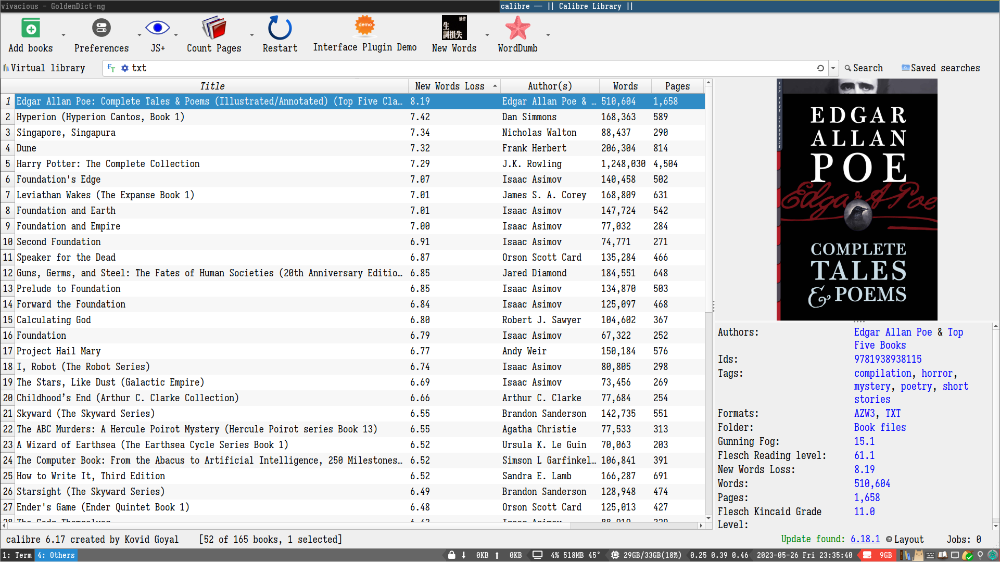

# Demo

# Requirements

* numpy
* stanza (optional, generate lemmas better than the traditional way)

# Features

All for One: Iterate all selected books and generate a whole file that counts and sort new words. Then you can memorize them effectively.

# TODO

* Explain new word loss here.
* ~~Use an AI lemmatizer to handle lemmas.~~
* ~~Use job manager.~~
* Use progression bar like count_pages.
* ~~Show new words count and top five items.~~
* ~~Fix config widget size. https://www.mobileread.com/forums/showthread.php?t=354124~~
* Use tmp files when txt format unavailable.
* Use gui2.warning_dialog to complement existing logging.warning
* Use gui.proceed_question, like action.py:275 in count_pages
* Rename the project to New-Words-Loss, including plugin-import-name-new_words.txt
